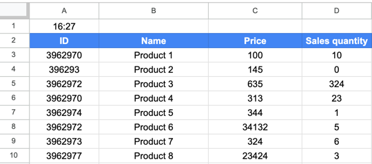

<br/>
<p align="center">
<a href="https://github.com/razllivan/django-florist-app">
    
  </a>
  <h3 align="center">Digiseller to Google Sheets</h3>

  <p align="center">
    This Python project retrieves data about products from the Digiseller API and sends it to Google Sheets for easy management and analysis.
    <br/>
    <br/>
  </p>


## Table Of Contents
* [Key Features](#key-features)
* [Technology Stack](#technology-stack)
* [Getting Started](#getting-started)
    * [Prerequisites](#prerequisites)
    * [Setting Up Google Service Account](#setting-up-google-service-account)
    * [Installation and Running](#installation-and-running)
* [Project Settings](#project-setings)


## Key Features



- **Automated Sync**: Automatically syncs product data from Digiseller to Google Sheets, ensuring that your spreadsheet always has the latest information.
- **Service Account Integration**: Utilizes Google service accounts for secure and reliable API authentication with Google Sheets.
- **Docker Support**: Easy to set up and run with Docker Compose, providing a consistent runtime environment.
- **Retry Mechanism**: Customizable retry intervals (`REPEAT_INTERVALS`) to handle failures when calling external APIs, enhancing the robustness of the application.
- **Regular Updates**: Scheduled updates (`UPDATE_INTERVAL`) to continuously fetch and refresh data at defined time intervals.
- **Customizable Data Offset**: The ability to exclude rows at the beginning of the product table (`PRODUCT_TABLE_ROWS_TO_EXCLUDE`) for custom data layout in Google Sheets.
- **Logging**: Comprehensive logging using Loguru, with configuration for both console and file output with rotation.

## Technology Stack
- **Python 3.11**
- **Poetry**
- **Docker**

## Getting Started

### Prerequisites

* docker

### Setting up Google Service Account

To access Google Sheets from your application, you need to create a service account:

1. Go to the [Google Developers Console](https://console.developers.google.com/) and create a new project or select an existing one.
2. In the "Search for APIs and Services" box, find "Google Drive API" and enable it.
3. In the same search box, find "Google Sheets API" and enable it as well.
4. Navigate to "APIs & Services > Credentials" and choose "Create credentials > Service account key".
5. Fill out the form and assign the role of editor.
6. Click "Manage service accounts" above the Service Accounts section.
7. Click on the three dots (⋮) next to the newly created service account, select "Manage keys", and then click on "ADD KEY > Create new key".
8. Choose the JSON key type and click "Create".
9. Copy the service account's email address from the downloaded key (look for the 'client_email' field) or from the "Service Accounts" tab.
10. In your spreadsheet's settings, go to the sharing settings and share your spreadsheet with the service account email, granting editor access.
11. Rename downloaded JSON file to `service_account.json`.

Refer to this guide when you in  installation process.

### Installation and Running


1. Clone the repository:

```bash
git clone https://github.com/razllivan/digiseller-to-google-sheets.git &&
cd digiseller-to-google-sheets
```
2. Copy and rename the sample .env file:

```bash
cp sample.env .env
```

3. Edit .env file and update it with your details:

- `SPREADSHEET_URL`: The URL of the Google Sheets where data will be synced to. You can find this URL in the Sheets settings under 'Access settings > Copy'.
- `WORKSHEET_NAME`: The name of the worksheet within the Google Sheets that you'll be working with.
- `DIGISELLER_API_KEY`: Your Digiseller API key. This can be obtained from you Digi account and is sent to your WebMoney.
- `DIGISELLER_SELLER_ID`: Your Digiseller seller identifier, which can be found in your account settings under 'Details > Contact information'.

4. Place the service_account.json in the project folder ([how to get it](#setting-up-google-service-account))


5. Run using Docker Compose:

```bash
docker-compose up -d --build
```
## Project Settings
The project relies on several settings defined in the `settings.py` file. Here’s a brief overview of the key settings:

- `BASE_DIR`: The base directory of the project, automatically set to the directory where `settings.py` is located.
- `CREDENTIALS_PATH`: Path to the `service_account.json` file for Google API authentication. By default, it's set to be in the same directory as `settings.py`.
- `REPEAT_INTERVALS`: A list of intervals (in seconds) defining the retry behavior in case of a failure when calling external APIs.
- `UPDATE_INTERVAL`: The time interval (in seconds) at which the application will perform regular updates.
- `PRODUCT_TABLE_ROWS_TO_EXCLUDE`: This setting allows you to exclude a specific number of rows from the beginning of the product table during processing. The default value is 2. This feature was added to provide flexibility in how the data is displayed in your Google Sheets. You can set this to a number greater than 0 if you want to leave some space at the top of your sheet for additional information, headers, or descriptions before the data begins.

Logging:

The application uses Loguru for logging. The configuration in `settings.py` sets up logging to both standard error stream and a file with a 7-day rotation.


> **Note**: To modify environment variables, create a `.env` file in the project's root directory and set your values there. 
